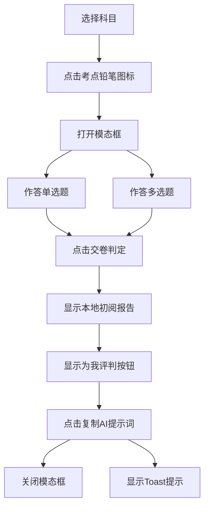
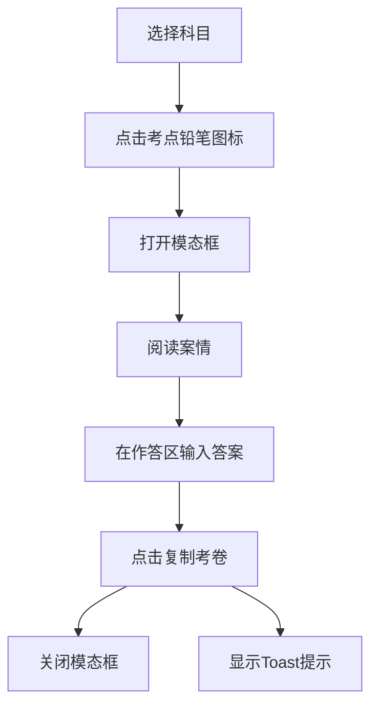

# 易懂法考-第一堂课 产品需求文档 (PRD)

## 1. 产品概述

易懂法考-第一堂课是一款面向中国国家统一法律职业资格考试（法考）考生的结构化互动学习网页。通过可视化的考试结构拆解、可交互的考点演练和AI赋能的评判机制，帮助考生在第一堂课就建立对法考全局的认知，并提供沉浸式的真题演练体验。

- **目标用户**：初次接触法考的考生、需要系统复习的二战考生
- **核心价值**：让考生快速理解法考结构、通过互动演练掌握高频考点、借助AI获得个性化学习反馈

## 2. 核心功能模块

### 2.1 全局鸟瞰页（如何考？）
展示法考的整体结构和考试规则，帮助考生建立全局认知。

| 模块 | 功能描述 |
|------|----------|
| 双核通关公式卡片 | 客观题阶段（蓝渐变）和主观题阶段（金渐变）的考试规则可视化卡片 |
| 考试时间节点表 | 三段式网格布局：试卷一（公法卷）、试卷二（私法卷）、主观题试卷的详细拆解 |

### 2.2 客观题演练页（卷一/卷二）
提供客观题考点的全真演练，包含单选和多选题型。

| 模块 | 功能描述 |
|------|----------|
| 折叠式科目列表 | 各科目默认收起，点击展开显示高频考点 |
| 全真体验模态框 | 点击铅笔图标唤出弹窗，提供单选+多选双题并列架构 |
| 本地交卷判定 | 本地逻辑校验，多选题执行严格的"错选、漏选、多选均归零"标准 |
| AI联动评判 | 交卷后显示"为我评判"按钮，一键复制AI提示词到剪贴板 |

### 2.3 主观题演练页（案例演练）
提供主观题案例的沉浸式作答体验。

| 模块 | 功能描述 |
|------|----------|
| 折叠式科目列表 | 与客观题页保持一致的交互逻辑 |
| 主观题模态框 | 上部案情区域（高度限制5行，可滚动）、中部作答区（大面积Textarea） |
| 一键复制考卷 | 将科目、考点、案情、作答与AI提示词熔炼后复制到剪贴板 |

## 3. 核心流程

### 3.1 页面导航流程


### 3.2 客观题演练流程



### 3.3 主观题演练流程



## 4. 用户界面设计

### 4.1 设计规范

**色彩系统**：
- 主色调：法考蓝 `#2563EB`（客观题相关）
- 辅色调：主观金 `#F59E0B` / 橘 `#F97316`（主观题相关）
- 背景色：浅灰 `#F8FAFC`
- 文字色：深灰 `#1E293B`（主文字）、中灰 `#64748B`（次要文字）

**字体规范**：
- 标题字体：系统默认无衬线字体，加粗
- 正文字体：系统默认无衬线字体，确保中文高易读性
- 字体大小：标题 `text-xl` ~ `text-2xl`，正文 `text-sm` ~ `text-base`

**布局规范**：
- 左侧菜单栏：宽度 `240px`，可折叠至 `64px`
- 右侧内容区：自适应剩余宽度
- 全局头部：Sticky定位，高度 `64px`

### 4.2 页面设计详情

#### 全局头部（Sticky Header）
| 元素 | 位置 | 说明 |
|------|------|------|
| 品牌标题 | 左侧 | "易懂法考" |
| 页面主题标签 | 品牌标题右侧 | 动态显示当前页面主题，如"第一堂课：如何考？" |
| 页码进度 | 右侧 | 格式：第 X / 4 页 |
| 导航按钮 | 页码进度右侧 | 上一页/下一页，边界状态自动禁用 |

#### 全局鸟瞰页
| 模块 | 布局 | 样式 |
|------|------|------|
| 双核通关公式卡片 | 双列网格 | 左卡片：蓝到靛蓝渐变；右卡片：琥珀到橘渐变 |
| 考试时间节点表 | 三列网格 | 每列包含：标题、时间、题型分值、科目标签网格 |

#### 客观题/主观题演练页
| 模块 | 布局 | 样式 |
|------|------|------|
| 科目列表 | 垂直折叠面板 | 默认收起，点击展开 |
| 考点项 | 水平排列 | 考点名称左侧，铅笔图标右侧 |
| 模态框 | 居中弹窗 | 宽度 `640px`，圆角 `12px` |

### 4.3 响应式设计

- **桌面端**（≥1024px）：完整双栏布局
- **平板端**（768px-1023px）：侧边栏可折叠，内容区自适应
- **移动端**（<768px）：侧边栏变为抽屉式，内容区单列布局

## 5. 内置AI提示词设计

### 5.1 客观题"为我评判"提示词模板

```markdown
你是一位高胜率的中国国家统一法律职业资格考试（法考）客观题辅导名师。
请对学生的如下做题结果、考点上下文进行精准错因剖析，指出干扰项的挖坑套路。

【科目领域】: {科目名称}
【核心考点】: {考点标题}

【单选题干】: {单选题干}
【学生作答】: {单选用户答案} | 【正确答案】: {单选正确答案}

【多选题干】: {多选题干}
【学生作答】: {多选用户答案} | 【正确答案】: {多选正确答案}

--------------------------------------------------
【分析任务要求】:
1. 聚焦于学生做错的题型。拆解选项中似是而非的错误表述，指出命题人在法考真题里常设的"偷换概念"或"脑补情节"陷阱。
2. 总结该考点的一句精简独家"秒杀口诀"，帮助学生加深记忆。
```

### 5.2 主观题"阅卷组专家"提示词模板

```markdown
你是一位资深的中国国家统一法律职业资格考试（法考）主观题阅卷组专家。
请按照官方阅卷标准，对以下学生答卷进行专业评分和深度点评。

【科目领域】: {科目名称}
【核心考点】: {考点标题}

【案情材料】:
{案情内容}

【学生答卷】:
{学生作答内容}

--------------------------------------------------
【阅卷任务要求】:
1. **得分点分析**：列出本题的所有采分点，标注学生答对/答错/遗漏的情况。
2. **评分与理由**：给出预估分数（满分XX分），并说明扣分原因。
3. **答题规范点评**：指出学生在答题结构、法条引用、逻辑表达等方面的问题。
4. **改进建议**：提供一份"参考答案要点"，指导学生如何组织更完美的答案。
5. **知识延伸**：针对该考点，补充1-2个易混淆或易遗漏的知识点。
```

## 6. 数据需求

### 6.1 知识库数据结构

知识库位于 `c:\Users\Administrator\Documents\codes\易懂法考\知识库`，包含：

**科目分类**：
- 试卷一（公法卷）：法治思想、法理学、宪法、中国法律史、国际法、司法制度和法律职业道德、刑法、刑事诉讼法、行政法与行政诉讼法
- 试卷二（私法卷）：民法、知识产权法、商法、经济法、环境资源法、劳动与社会保障法、国际私法、国际经济法、民事诉讼法（含仲裁制度）
- 主观题科目：法治思想、法理学、宪法、刑法、刑事诉讼法、民法、商法、民事诉讼法（含仲裁制度）、行政法与行政诉讼法、司法制度和法律职业道德

**数据格式**：
- 每个科目一个目录（如 `07_刑法`、`10_民法`）
- 每个目录包含 `README.md`，记录该科目的章节结构和考点列表
- 法考大纲位于 `法考大纲.md`

### 6.2 题目数据（模拟数据）

由于知识库中不包含具体题目数据，系统需要内置模拟题目数据：

**客观题数据结构**：
```typescript
interface ObjectiveQuestion {
  id: string;
  subject: string;
  topic: string;
  type: 'single' | 'multiple';
  question: string;
  options: { label: string; text: string }[];
  correctAnswer: string | string[];
  explanation: string;
}
```

**主观题数据结构**：
```typescript
interface SubjectiveQuestion {
  id: string;
  subject: string;
  topic: string;
  caseText: string;
  question: string;
  referenceAnswer: string;
}
```

## 7. 交互细节

### 7.1 Toast提示规范

| 场景 | 内容 | 持续时间 | 位置 |
|------|------|----------|------|
| 客观题提示词复制成功 | "客观题错因剖析提示词已复制！请前往'豆包'或'DeepSeek'粘贴（Ctrl+V），AI将为您深度复盘选项陷阱。" | 5秒 | 右下角 |
| 主观题提示词复制成功 | "主观题答卷与评分提示词复制成功！请立即在'DeepSeek'或'豆包'中粘贴发送，AI将以阅卷组专家标准为你出具判卷报告。" | 5秒 | 右下角 |

### 7.2 模态框交互规范

- 打开动画：淡入 + 缩放，持续 `200ms`
- 关闭动画：淡出 + 缩放，持续 `150ms`
- 点击遮罩层可关闭
- 按 ESC 键可关闭
- 关闭后焦点回到触发按钮

### 7.3 折叠面板交互规范

- 展开/收起动画：高度过渡，持续 `300ms`
- 使用 ease-in-out 缓动函数
- 图标旋转指示状态

## 8. 技术约束

- **技术栈**：Vue 3 (Composition API) + TypeScript + naive-ui + @vicons/*
- **构建工具**：Vite
- **样式方案**：naive-ui 原生样式 + 少量自定义 CSS
- **状态管理**：Vue 响应式系统（ref/reactive/computed）
- **代码规范**：遵循 skill-NaiveUi.md 和 skill-编码规范.md
