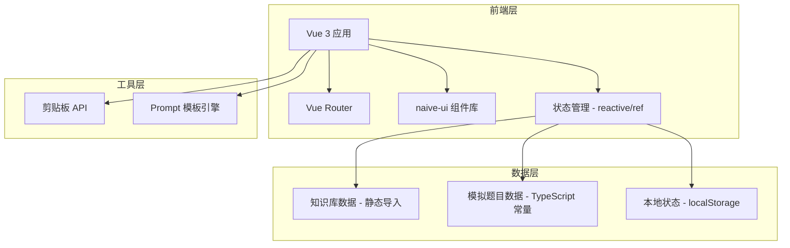

# 易懂法考-第一堂课 技术架构文档

## 1. 架构设计



## 2. 技术选型

| 技术 | 版本 | 用途 |
|------|------|------|
| Vue | 3.x | 前端框架，Composition API |
| TypeScript | 5.x | 类型安全 |
| Vite | 5.x | 构建工具 |
| Vue Router | 4.x | 路由管理 |
| naive-ui | 2.x | UI 组件库 |
| @vicons/fluent | latest | 图标库 |
| @vicons/ionicons5 | latest | 图标库（补充） |

## 3. 路由定义

| 路由 | 名称 | 用途 |
|------|------|------|
| / | Layout | 主布局（含侧边栏和头部） |
| /overview | Overview | 全局鸟瞰页（如何考？） |
| /objective/paper1 | ObjectivePaper1 | 客观题卷一（公法卷） |
| /objective/paper2 | ObjectivePaper2 | 客观题卷二（私法卷） |
| /subjective | Subjective | 主观题案例演练 |

## 4. 项目结构

```
易懂法考/
├── .trae/
│   └── documents/
│       ├── prd.md
│       └── tech-spec.md
├── public/
├── src/
│   ├── assets/
│   │   └── styles/
│   │       └── global.css
│   ├── components/
│   │   ├── AppHeader.vue          # 全局头部
│   │   ├── SideMenu.vue           # 侧边栏菜单
│   │   ├── ExamOverviewCards.vue  # 双核通关公式卡片
│   │   ├── ExamScheduleGrid.vue   # 考试时间节点表
│   │   ├── SubjectAccordion.vue   # 折叠式科目列表
│   │   ├── TopicItem.vue          # 考点项
│   │   ├── ObjectiveModal.vue     # 客观题模态框
│   │   ├── SubjectiveModal.vue    # 主观题模态框
│   │   └── ToastProvider.vue      # Toast 提示封装
│   ├── composables/
│   │   ├── useClipboard.ts        # 剪贴板操作
│   │   ├── usePageNavigation.ts   # 页面导航逻辑
│   │   └── useToast.ts            # Toast 提示
│   ├── data/
│   │   ├── subjects.ts            # 科目数据（从知识库提取）
│   │   ├── objectiveQuestions.ts  # 客观题模拟数据
│   │   ├── subjectiveQuestions.ts # 主观题模拟数据
│   │   └── prompts.ts             # AI 提示词模板
│   ├── layouts/
│   │   └── MainLayout.vue         # 主布局
│   ├── router/
│   │   └── index.ts               # 路由配置
│   ├── types/
│   │   └── index.ts               # 类型定义
│   ├── views/
│   │   ├── OverviewView.vue       # 全局鸟瞰页
│   │   ├── ObjectiveView.vue      # 客观题演练页（复用）
│   │   └── SubjectiveView.vue     # 主观题演练页
│   ├── App.vue
│   └── main.ts
├── index.html
├── package.json
├── tsconfig.json
├── vite.config.ts
└── tailwind.config.js
```

## 5. 类型定义

```typescript
// src/types/index.ts

export interface Subject {
  id: string;
  name: string;
  icon: string;
  paper: 'paper1' | 'paper2' | 'both';
  hasSubjective: boolean;
  topics: Topic[];
}

export interface Topic {
  id: string;
  name: string;
  description: string;
}

export interface ObjectiveQuestion {
  id: string;
  subjectId: string;
  topicId: string;
  type: 'single' | 'multiple';
  question: string;
  options: Option[];
  correctAnswer: string | string[];
  explanation: string;
}

export interface Option {
  label: string;
  text: string;
}

export interface SubjectiveQuestion {
  id: string;
  subjectId: string;
  topicId: string;
  caseText: string;
  question: string;
  referenceAnswer: string;
}

export interface ExamPaper {
  id: string;
  name: string;
  timeRange: string;
  duration: string;
  singleChoice: string;
  multipleChoice: string;
  totalScore: number;
  subjects: string[];
}

export interface PageInfo {
  index: number;
  title: string;
  route: string;
}
```

## 6. 数据模型

### 6.1 科目数据来源

从知识库目录结构提取科目信息：

```typescript
// src/data/subjects.ts
export const paper1Subjects = [
  { id: 'legal-thought', name: '习近平法治思想', ... },
  { id: 'jurisprudence', name: '法理学', ... },
  { id: 'constitution', name: '宪法', ... },
  // ... 共9科
];

export const paper2Subjects = [
  { id: 'civil-law', name: '民法', ... },
  { id: 'ip-law', name: '知识产权法', ... },
  // ... 共9科
];

export const subjectiveSubjects = [
  // 主观题10科
];
```

### 6.2 题目数据

由于知识库不包含具体题目，系统内置模拟数据：

- 每个高频考点至少包含1道单选题和1道多选题（客观题）
- 每个高频考点至少包含1道主观题案例（主观题）
- 题目数据以 TypeScript 常量形式存储，便于类型检查

## 7. 核心逻辑设计

### 7.1 页面导航逻辑

```typescript
// src/composables/usePageNavigation.ts
const pages: PageInfo[] = [
  { index: 1, title: '如何考？', route: '/overview' },
  { index: 2, title: '客观题 · 卷一（公法）', route: '/objective/paper1' },
  { index: 3, title: '客观题 · 卷二（私法）', route: '/objective/paper2' },
  { index: 4, title: '主观题案例演练', route: '/subjective' },
];

export function usePageNavigation() {
  const currentPage = computed(() => {
    const route = useRoute();
    return pages.find(p => p.route === route.path) || pages[0];
  });

  const canGoPrev = computed(() => currentPage.value.index > 1);
  const canGoNext = computed(() => currentPage.value.index < pages.length);

  const goPrev = () => { /* 导航到上一页 */ };
  const goNext = () => { /* 导航到下一页 */ };

  return { currentPage, canGoPrev, canGoNext, goPrev, goNext };
}
```

### 7.2 客观题判卷逻辑

```typescript
function checkObjectiveAnswer(
  userAnswer: string | string[],
  correctAnswer: string | string[],
  type: 'single' | 'multiple'
): boolean {
  if (type === 'single') {
    return userAnswer === correctAnswer;
  }
  // 多选题：错选、漏选、多选均归零
  const userSet = new Set(userAnswer as string[]);
  const correctSet = new Set(correctAnswer as string[]);
  return userSet.size === correctSet.size &&
         [...userSet].every(a => correctSet.has(a));
}
```

### 7.3 AI 提示词生成逻辑

```typescript
function generateObjectivePrompt(
  subject: string,
  topic: string,
  singleQ: ObjectiveQuestion,
  multiQ: ObjectiveQuestion,
  singleAnswer: string,
  multiAnswer: string[]
): string {
  return `你是一位高胜率的中国国家统一法律职业资格考试（法考）客观题辅导名师...
【科目领域】: ${subject}
【核心考点】: ${topic}
【单选题干】: ${singleQ.question}
【学生作答】: ${singleAnswer} | 【正确答案】: ${singleQ.correctAnswer}
...`;
}
```

## 8. 组件设计

### 8.1 主布局 (MainLayout.vue)

- 使用 `n-layout` + `n-layout-sider` + `n-layout-content`
- 侧边栏包含菜单项和折叠按钮
- 内容区包含 `AppHeader` 和 `router-view`

### 8.2 客观题模态框 (ObjectiveModal.vue)

Props:
- `subjectName: string`
- `topicName: string`
- `singleQuestion: ObjectiveQuestion`
- `multiQuestion: ObjectiveQuestion`

状态:
- `singleAnswer: string | null`
- `multiAnswer: string[]`
- `submitted: boolean`
- `showAiButton: boolean`

### 8.3 主观题模态框 (SubjectiveModal.vue)

Props:
- `subjectName: string`
- `topicName: string`
- `question: SubjectiveQuestion`

状态:
- `answer: string`

## 9. 样式规范

### 9.1 naive-ui 主题定制

```typescript
// main.ts
const themeOverrides = {
  common: {
    primaryColor: '#2563EB',
    primaryColorHover: '#1D4ED8',
    primaryColorPressed: '#1E40AF',
    successColor: '#10B981',
    warningColor: '#F59E0B',
    errorColor: '#EF4444',
  }
};
```

### 9.2 全局样式

```css
/* src/assets/styles/global.css */
html, body, #app {
  height: 100%;
  margin: 0;
}

/* 隐藏滚动条但保留滚动功能 */
.hide-scrollbar {
  scrollbar-width: none;
  -ms-overflow-style: none;
}
.hide-scrollbar::-webkit-scrollbar {
  display: none;
}
```

## 10. 性能优化

- 路由懒加载：页面组件使用 `() => import('@/views/xxx.vue')`
- 按需引入：naive-ui 组件和 @vicons 图标全部按需引入
- 静态数据：题目数据作为编译时常量，无需异步加载
- 本地存储：侧边栏折叠状态持久化到 localStorage

## 11. 可访问性

- 所有按钮和链接有明确的 `aria-label`
- 表单输入关联 `<label>`
- 弹窗打开时焦点自动进入，关闭后焦点回到触发元素
- 颜色对比度符合 WCAG 2.1 AA 标准
